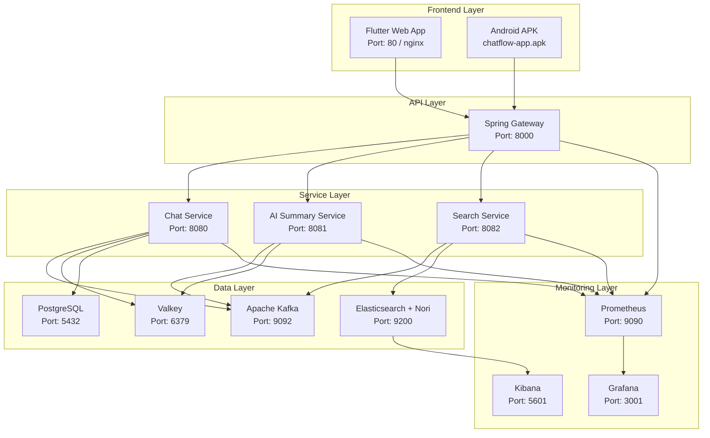

# ChatFlow - 실시간 채팅 + AI 요약 시스템 🚀

> **현대적인 마이크로서비스 아키텍처**로 구축된 실시간 채팅 플랫폼  
> AI 기반 대화 요약, 한국어 검색, 크로스 플랫폼 지원

[](https://openjdk.java.net/projects/jdk/21/)
[](https://spring.io/projects/spring-boot)
[](https://flutter.dev/)
[](https://dart.dev/)
[](https://valkey.io/)
[](LICENSE)
[](https://github.com/KwonSeungwon/chat_flow/actions)
[](config/checkstyle/checkstyle.xml)

## 📋 목차
- [🏗️ 시스템 아키텍처](#️-시스템-아키텍처)
- [🚀 기술 스택](#-기술-스택)
- [✨ 주요 기능](#-주요-기능)
- [🏃‍♂️ 빠른 시작](#️-빠른-시작)
- [📦 모듈 구조](#-모듈-구조)
- [🔧 환경 설정](#-환경-설정)
- [📊 서비스 접속 정보](#-서비스-접속-정보)
- [🌐 API 명세](#-api-명세)
- [🚢 배포 가이드](#-배포-가이드)
- [🧪 테스트](#-테스트)
- [🛡️ 코드 품질](#️-코드-품질)

## 🏗️ 시스템 아키텍처



## 🚀 기술 스택

### 🖥️ **Frontend**
-  **Flutter 3.22** - 크로스 플랫폼 UI (Web + Android)
-  **Dart 3.3** - 타입 안전 언어
-  **Riverpod 2.5** - 반응형 상태 관리
-  **GoRouter 14** - 선언적 라우팅
-  **Dio 5** - HTTP 클라이언트 (JWT 인터셉터)
-  **stomp_dart_client** - WebSocket 실시간 통신

### ⚡ **Backend**
-  **Java 21** - LTS 버전, 최신 기능
-  **Spring Boot 3.2** - 엔터프라이즈 프레임워크
-  **Spring WebSocket** - 실시간 통신
-  **Apache Kafka** - 이벤트 스트리밍
-  **LangChain4J** - AI 통합 프레임워크
-  **Google Gemini** - AI 언어 모델

### 🗄️ **Data & Search**
-  **Valkey 7.2** - Redis 호환 인메모리 DB
-  **Elasticsearch 8.11** - 검색 엔진
-  **Nori 분석기** - 한국어 형태소 분석
-  **PostgreSQL 16** - 관계형 데이터베이스

### 📊 **DevOps & Monitoring**
-  **Docker & Compose** - 컨테이너화 (non-root 실행)
-  **Helm** - Kubernetes 패키지 매니저 (umbrella chart)
-  **Prometheus** - 메트릭 수집
-  **Grafana** - 모니터링 대시보드
-  **Gradle 8.5** - 빌드 자동화 (JaCoCo + Checkstyle)
-  **GitHub Actions** - 자동화 파이프라인

## ✨ 주요 기능

### 🎯 **핵심 기능**
- **🔄 실시간 채팅** - WebSocket/STOMP 기반 즉시 메시지 전송
- **🤖 AI 요약 & Q&A** - Google Gemini 2.0 Flash로 대화 요약 + AI 질문 답변
- **🔍 한국어 검색** - Nori 형태소 분석기 + N-gram 부분 매칭 + 의료 용어 동의어
- **📱 크로스 플랫폼** - Flutter Web + Android APK 지원
- **🏗️ 마이크로서비스** - 독립적이고 확장 가능한 아키텍처

### 🏥 **EMR (병원 시스템) 연계 기능**
- **🔄 인수인계 채팅방** - SBAR 구조화 템플릿 (Situation/Background/Assessment/Recommendation)
- **📋 환자 카드 메시지** - 환자명/병실/진단/바이탈을 구조화된 카드로 공유
- **🚨 긴급 메시지** - ROUTINE/URGENT/STAT 우선순위 플래그
- **📊 AI SOAP 임상 노트** - HANDOFF 방 전용 SOAP 형식 자동 요약
- **📝 교대 보고서** - AI 기반 근무 교대 인수인계 보고서 자동 생성
- **👥 역할 기반 접근제어 (RBAC)** - 의사/간호사/약사/관리자 역할별 방 접근 제한
- **✅ 읽음 확인** - STOMP 기반 실시간 읽음 상태 추적
- **🏥 HL7 FHIR 연동** - 환자/처방 데이터 조회 API (Mock)
- **💊 처방/검사 알림** - Kafka 기반 오더 이벤트 → 채팅방 자동 시스템 알림
- **📜 감사 로그** - 메시지 접근 이력 ES 인덱싱 (의료법 준수)
- **🔐 메시지 암호화** - AES-256-GCM at-rest 암호화

### 💎 **고급 기능**
- **🎨 모던 UI/UX** - Material 3 디자인, 채팅+의료 십자 앱 아이콘
- **🌙 다크/라이트 모드** - 테마 토글 지원
- **🚀 성능 최적화** - Valkey 캐싱, Outbox 패턴, 비동기 Kafka 파이프라인
- **📈 실시간 모니터링** - Prometheus/Grafana 메트릭
- **🔐 보안** - JWT 인증 + 토큰 블랙리스트, 비밀방 비밀번호, Gateway CORS
- **🔔 FCM 푸시 알림** - Firebase Cloud Messaging 기반 실시간 알림

### 🎪 **사용자 경험**
- **채팅방별 색상 구분** - 시각적 식별성 강화
- **검색 결과 하이라이트** - 검색어 강조 표시
- **반응형 디자인** - 768px 브레이크포인트 (모바일 drawer / 데스크톱 사이드바)
- **의료 용어 동의어 검색** - 바이탈↔활력징후, 처방↔오더 등 15종 자동 매핑

## 🏃‍♂️ 빠른 시작

### 🔧 **사전 요구사항**
- **Java 21+** (OpenJDK 권장)
- **Flutter SDK 3.22+**
- **Docker & Docker Compose**
- **Git**

### ⚡ **1분만에 실행하기**

```bash
# 1. 프로젝트 클론
git clone https://github.com/KwonSeungwon/chat_flow.git
cd chat_flow

# 2. 인프라 서비스 실행 (백그라운드)
docker compose up -d valkey kafka elasticsearch postgresql

# 3. 백엔드 빌드 & 실행
./gradlew build
./gradlew bootRun --parallel

# 4. 프론트엔드 실행 (새 터미널)
cd frontend
flutter pub get
flutter run -d chrome
```

🎉 **완료!** Chrome에서 Flutter 앱 실행됨

### 📱 **Android APK 빌드**

```bash
cd frontend
flutter build apk --release
# 빌드 결과: build/app/outputs/flutter-apk/app-release.apk
# 또는 웹에서 /chatflow-app.apk 경로로 다운로드 가능
```

## 📦 모듈 구조

```
chat_flow/
├── 🎨 frontend/                    # Flutter Web + Android
│   ├── lib/
│   │   ├── main.dart              # 앱 엔트리포인트 (ProviderScope, dotenv)
│   │   ├── core/
│   │   │   ├── network/
│   │   │   │   ├── dio_client.dart    # HTTP 클라이언트 + JWT 인터셉터
│   │   │   │   └── stomp_service.dart # WebSocket STOMP (자동 재연결)
│   │   │   ├── routing/
│   │   │   │   └── app_router.dart    # GoRouter (token 기반 redirect)
│   │   │   └── theme/
│   │   │       ├── app_theme.dart     # Material 3 라이트/다크 테마
│   │   │       └── theme_provider.dart # themeModeProvider (StateProvider)
│   │   ├── features/
│   │   │   ├── auth/
│   │   │   │   ├── auth_provider.dart # AuthNotifier + 게스트 로그인
│   │   │   │   └── login_page.dart    # 로그인/회원가입/게스트 UI
│   │   │   ├── chat/
│   │   │   │   ├── chat_provider.dart # ChatRoomsNotifier + ChatNotifier
│   │   │   │   ├── chat_page.dart     # 반응형 채팅 페이지 (사이드바+메시지)
│   │   │   │   └── widgets/
│   │   │   │       ├── chat_room_sidebar.dart  # 채팅방 목록
│   │   │   │       ├── chat_messages_list.dart # 메시지 버블 렌더링
│   │   │   │       ├── chat_input.dart         # 입력창 + 이모지
│   │   │   │       └── create_room_dialog.dart # 채팅방 생성 다이얼로그
│   │   │   └── search/
│   │   │       ├── search_provider.dart # SearchNotifier (한국어 검색)
│   │   │       └── search_page.dart     # 검색 + 결과 하이라이트
│   │   ├── shared/models/
│   │   │   ├── chat_message.dart   # ChatMessage (fromJson/toJson)
│   │   │   └── chat_room.dart      # ChatRoom (fromJson, isFull)
│   │   └── core/utils/
│   │       ├── apk_downloader.dart      # 조건부 export
│   │       ├── apk_downloader_web.dart  # dart:html AnchorElement
│   │       └── apk_downloader_stub.dart # no-op (non-web)
│   ├── android/app/build.gradle.kts  # minSdk=23 (flutter_secure_storage 요구)
│   ├── web/chatflow-app.apk          # 배포용 APK (nginx /chatflow-app.apk)
│   ├── nginx.conf                    # 리버스 프록시 + 캐시 정책
│   ├── Dockerfile                    # nginx:alpine 컨테이너
│   └── pubspec.yaml                  # Flutter 의존성
├── 🏗️ common/                      # 공통 라이브러리
│   └── src/main/java/com/chatflow/common/
│       ├── dto/
│       │   ├── BaseMessage.java       # 메시지 기본 클래스
│       │   ├── ChatMessage.java       # 채팅 메시지 DTO
│       │   ├── ApiResponse.java       # 공통 API 응답 래퍼
│       │   └── ErrorResponse.java     # 공통 에러 응답 DTO
│       ├── exception/
│       │   └── BaseExceptionHandler.java  # 공통 예외 핸들러
│       └── KafkaCommonConfig.java # Kafka 공통 설정
├── 💬 chat-service/                # 실시간 채팅 서비스 (Port: 8080)
│   └── src/main/java/com/chatflow/chat/
│       ├── ChatController.java    # WebSocket STOMP 핸들러
│       ├── ChatService.java       # 메시지 처리 + Kafka 발행
│       └── WebSocketConfig.java   # WebSocket/STOMP 설정
├── 🤖 ai-summary-service/          # AI 요약 서비스 (Port: 8081)
│   └── src/main/java/com/chatflow/aisummary/
│       └── AiSummaryService.java  # Kafka 소비 → Gemini 요약 → Kafka 발행
├── 🔍 search-service/              # 검색 서비스 (Port: 8082)
│   └── src/main/java/com/chatflow/search/
│       ├── SearchController.java      # REST API 엔드포인트
│       ├── SearchService.java         # Kafka 소비 → ES 인덱싱
│       ├── KoreanSearchService.java   # 한국어 검색 (Nori + N-gram)
│       ├── ElasticsearchConfig.java   # ES 클라이언트 설정
│       ├── IndexInitializer.java      # 인덱스 자동 생성
│       └── ChatMessageDocument.java   # ES 도큐먼트 매핑
├── 🚪 gateway-service/             # API 게이트웨이 (Port: 8000)
│   └── src/main/java/com/chatflow/gateway/
│       ├── security/
│       │   ├── AuthService.java              # 인증 (회원가입/로그인/로그아웃)
│       │   ├── JwtUtil.java                  # JWT 토큰 생성/검증
│       │   ├── JwtAuthenticationWebFilter.java # JWT 인증 필터
│       │   └── TokenBlacklistService.java    # Valkey 기반 토큰 블랙리스트
│       └── config/
│           ├── SecurityConfig.java           # Spring Security 설정
│           └── CorsConfig.java               # CORS 설정
├── ⎈ helm/chatflow/               # Helm umbrella chart
│   ├── Chart.yaml                 # 차트 메타데이터
│   ├── values.yaml                # 공통 설정값
│   └── charts/                    # 서비스별 subchart (5개)
├── 🐳 elasticsearch/               # Elasticsearch 설정
│   ├── Dockerfile                 # Nori 플러그인 포함
│   └── config/
│       └── korean-analyzer-config.json  # 한국어 분석기 설정
├── 📊 monitoring/                  # 모니터링 설정
│   └── prometheus.yml
├── 🚢 k8s/                        # Kubernetes 매니페스트
├── 📜 scripts/                    # 배포 및 유틸리티 스크립트
├── 🔍 config/checkstyle/          # Checkstyle 설정 (Google Style 기반)
├── 📋 docker-compose.local.yml    # 로컬 개발 환경 설정
└── 🔄 .github/workflows/          # CI/CD 파이프라인
    ├── ci.yml                     # 테스트 + 품질 게이트 + Docker 빌드
    ├── release.yaml               # GHCR 푸시 + 스테이징 배포
    └── deploy-prod.yaml           # 프로덕션 배포 (승인 게이트)
```

## 🔧 환경 설정

### 🌟 **필수 환경 변수**

```bash
# AI Summary Service - Gemini API 키
export GEMINI_API_KEY="AIza-your-gemini-api-key"

# 개발 환경에서 IDE 실행 시
# IntelliJ IDEA: Run Configuration > Environment variables
# VS Code: launch.json에 env 설정

# Gemini API 키 발급 방법:
# 1. https://aistudio.google.com/app/apikey 접속
# 2. "Create API key" 클릭하여 새 키 생성
# 3. 생성된 키를 환경변수에 설정
```

### ⚙️ **선택적 설정**

```bash
# Valkey 연결 정보 (기본값)
VALKEY_HOST=localhost
VALKEY_PORT=6379

# Elasticsearch 연결 정보 (기본값)  
ELASTICSEARCH_URL=http://localhost:9200

# Kafka 연결 정보 (기본값)
KAFKA_BOOTSTRAP_SERVERS=localhost:9092

# 로그 레벨 (개발: DEBUG, 운영: INFO)
LOGGING_LEVEL_ROOT=INFO
```

### 🔐 **프로덕션 설정**

```yaml
# application-prod.yml 예시
spring:
  profiles:
    active: prod
  datasource:
    url: jdbc:postgresql://prod-db:5432/chatflow
    username: ${DB_USERNAME}
    password: ${DB_PASSWORD}
  redis:
    host: ${VALKEY_HOST:prod-valkey}
    port: ${VALKEY_PORT:6379}
    password: ${VALKEY_PASSWORD}
    
logging:
  level:
    com.chatflow: INFO
    root: WARN
```

## 📊 서비스 접속 정보

### 🚀 **애플리케이션**
| 서비스 | URL | 설명 |
|--------|-----|------|
| **웹 앱 (로컬)** | chrome (`flutter run -d chrome`) | Flutter Web 개발 서버 |
| **웹 앱 (프로덕션)** | https://app.chatflow.ai.kr | K3s + Cloudflare Tunnel |
| **Android APK** | https://app.chatflow.ai.kr/chatflow-app.apk | 웹 UI 다운로드 버튼 |
| **API Gateway** | http://localhost:8000 | 통합 API 엔드포인트 |
| **WebSocket** | ws://localhost:8000/ws-native | STOMP 실시간 통신 |

### 🔧 **개발 도구**
| 도구 | URL | 계정 | 설명 |
|------|-----|------|------|
| **Grafana** | http://localhost:3001 | admin/admin | 모니터링 대시보드 |
| **Prometheus** | http://localhost:9090 | - | 메트릭 수집기 |
| **Kibana** | http://localhost:5601 | - | Elasticsearch 관리 |
| **Swagger UI** | http://localhost:8000/swagger-ui.html | - | API 문서 |

### 🛠️ **인프라 서비스**
| 서비스 | 포트 | 설명 |
|--------|------|------|
| **Valkey** | 6379 | Redis 호환 캐시 |
| **Kafka** | 9092 | 메시지 큐 |
| **Elasticsearch** | 9200 | 검색 엔진 |
| **PostgreSQL** | 5432 | 메인 데이터베이스 |
| ~~Zookeeper~~ | ~~2181~~ | KRaft 모드 전환으로 제거됨 |

## 🌐 API 명세

### 🚪 **Gateway Routes**
- **Base URL**: http://localhost:8000
- **WebSocket**: ws://localhost:8000/ws

### 💬 **Chat API**
```http
# 채팅 메시지 전송
POST /api/chat/rooms/{roomId}/messages
Content-Type: application/json

{
  "content": "안녕하세요!",
  "username": "사용자"
}

# 채팅방 목록 조회
GET /api/chat/rooms

# 채팅방 생성
POST /api/chat/rooms
{
  "name": "새 채팅방",
  "description": "설명",
  "color": "#6366f1",
  "isPrivate": false
}
```

### 🤖 **AI Summary & Q&A API**
```http
# 채팅방 요약 조회
GET /api/ai-summary/room/{roomId}

# 요약 요청
POST /api/ai-summary/request
{ "chatRoomId": "room_xxx" }

# AI 질문 (대화 맥락 기반 답변)
POST /api/ai-summary/ask
{ "chatRoomId": "room_xxx", "question": "질문 내용" }
```

### 🔍 **Search API**
```http
# 한국어 검색
GET /api/search/korean?query=안녕&roomId=general&page=0&size=20

# N-gram 검색 (부분 매칭)
GET /api/search/ngram?query=안녕&roomId=general

# 시간대별 검색
GET /api/search/rooms/{roomId}/time-range?start=2024-01-01T00:00:00&end=2024-01-02T00:00:00
```

### 📊 **Health Check**
```http
# 서비스 상태 확인
GET /actuator/health

# 메트릭 조회
GET /actuator/metrics
GET /actuator/prometheus
```

## 🚢 배포 가이드

### 🐳 **Docker 배포**

#### 전체 스택 배포
```bash
# 프로덕션 환경 실행
docker-compose -f docker-compose.yml -f docker-compose.prod.yml up -d

# 로그 확인
docker-compose logs -f

# 스케일링
docker-compose up -d --scale chat-service=3
```

#### 개별 서비스 빌드
```bash
# 백엔드 서비스들 (amd64 크로스 빌드 — EC2 t3.small은 로컬 빌드 불가)
docker buildx build --platform linux/amd64 \
  --build-arg SERVICE_NAME=chat-service -t chatflow/chat-service:prod --load .
docker buildx build --platform linux/amd64 \
  --build-arg SERVICE_NAME=gateway-service -t chatflow/gateway-service:prod --load .

# 프론트엔드 (Flutter 빌드 후 Docker)
cd frontend
flutter build web --release
docker buildx build --platform linux/amd64 -t chatflow/frontend:prod --load .
cd ..

# Elasticsearch (Nori 포함)
docker buildx build --platform linux/amd64 \
  -t chatflow/elasticsearch:prod --load elasticsearch/
```

### 🖥️ **EC2 배포 (app.chatflow.ai.kr)**

```bash
# 1. 이미지 저장 & EC2 전송
docker save chatflow/frontend:prod | gzip > /tmp/frontend.tar.gz
scp -i ~/web-app-key.pem /tmp/frontend.tar.gz ubuntu@43.201.22.86:~/

# 2. EC2에서 로드 & 재시작
ssh -i ~/web-app-key.pem ubuntu@43.201.22.86 << 'EOF'
  docker load < frontend.tar.gz
  cd ~/chat_flow
  docker compose -f docker-compose.prod.yml up --no-deps -d frontend
  docker compose -f docker-compose.prod.yml ps
  docker image prune -f   # 공간 정리
EOF
```

> **레거시 EC2**: ubuntu@43.201.94.100 · t3.small (페이드아웃 중)
> **현재 프로덕션**: K3s (온프레미스) · Cloudflare Tunnel

### ☸️ **K3s 배포 (현재 프로덕션)**

```bash
# 1. 인프라 배포 (PostgreSQL, Valkey, Kafka KRaft, Elasticsearch)
kubectl apply -f k8s/infra/k3s-infra.yaml -n chatflow

# 2. Secrets 생성
bash scripts/create-secrets.sh chatflow

# 3. 이미지 빌드 & containerd import
./gradlew bootJar && flutter build web --release
docker save chatflow/gateway-service:latest ... | gzip > images.tar.gz
scp images.tar.gz ksw@node.chatflow.ai.kr:~/
ssh node.chatflow.ai.kr "sudo k3s ctr images import ~/images.tar.gz"

# 4. Helm 배포
helm upgrade --install chatflow helm/chatflow \
  -n chatflow -f helm/chatflow/values-k3s.yaml

# 5. 상태 확인
kubectl get pods -n chatflow
```

> **K3s 특이사항**:
> - `enableServiceLinks: false` — K8s 서비스 env 변수가 Kafka/Valkey와 충돌 방지
> - `imagePullPolicy: Never` — containerd 로컬 이미지 사용
> - Kafka KRaft 모드 (Zookeeper 제거, ~95Mi 절감)
> - JVM: `-Xmx256m -Xms128m -XX:+UseSerialGC` (시작 32초, 메모리 ~270Mi)

### ☸️ **Helm Chart 구조**

```bash
# 차트 검증 & 배포
helm lint helm/chatflow
helm template chatflow helm/chatflow -f helm/chatflow/values-k3s.yaml
helm upgrade chatflow helm/chatflow -n chatflow -f helm/chatflow/values-k3s.yaml
```

> Helm umbrella chart에 5개 subchart(gateway, chat, ai-summary, search, frontend) 포함.
> 모든 백엔드 Pod는 `securityContext` 적용 (non-root, readOnlyRootFilesystem, capabilities drop ALL).

### 🔄 **CI/CD Pipeline** (GitHub Actions)

| Workflow | 트리거 | 내용 |
|----------|--------|------|
| `ci.yml` | push/PR → main, develop | 백엔드 빌드(Checkstyle+JaCoCo+Test), 프론트엔드 lint+type-check+test+build, Docker 빌드, Trivy 보안 스캔 |
| `release.yaml` | push → release/*, hotfix/* | GHCR 이미지 푸시 + 스테이징 Helm 배포 |
| `deploy-prod.yaml` | workflow_dispatch | 프로덕션 배포 (수동 승인 게이트) |

## 🧪 테스트

### 🔍 **백엔드 테스트**
```bash
# 전체 빌드 + 테스트 + Checkstyle + JaCoCo
./gradlew build

# 개별 서비스 테스트
./gradlew :chat-service:test
./gradlew :ai-summary-service:test
./gradlew :search-service:test
./gradlew :gateway-service:test

# JaCoCo 커버리지 리포트 (build/reports/jacoco/)
./gradlew jacocoTestReport
```

각 서비스에 `@SpringBootTest` 컨텍스트 로드 테스트가 포함되어 있으며, 외부 의존성(Kafka, Redis, Elasticsearch)은 `@MockBean`으로 대체합니다.

### 🎨 **프론트엔드 테스트**
```bash
cd frontend

# 위젯 테스트
flutter test

# 린트 분석
flutter analyze

# 의존성 갱신
flutter pub get
```

### 🔍 **한국어 검색 테스트**
```bash
# Elasticsearch 한국어 검색 테스트
# 예상 결과:
# - "날씨" 검색 → "오늘 날씨가 좋네요" 매칭
# - "공원" 검색 → "공원을 걸었어요" 매칭
# - "Spring" 검색 → "Spring Boot 연동" 매칭
```

## 🛡️ 코드 품질

### **백엔드**
| 도구 | 용도 | 설정 |
|------|------|------|
| **Checkstyle** | Java 코드 스타일 검사 (Google Style 기반) | `config/checkstyle/checkstyle.xml` |
| **JaCoCo** | 코드 커버리지 리포트 (HTML + XML) | `build.gradle` (subprojects) |
| **BaseExceptionHandler** | 서비스 간 일관된 에러 응답 포맷 | `common` 모듈 |

### **프론트엔드**
| 도구 | 용도 | 설정 |
|------|------|------|
| **flutter analyze** | Dart 정적 분석 | `frontend/analysis_options.yaml` |
| **flutter_lints** | 린트 규칙 (권장 규칙셋) | `dev_dependencies` |
| **flutter test** | 위젯 단위 테스트 | `frontend/test/` |

### **보안**
| 항목 | 구현 |
|------|------|
| **인증** | JWT (발급/검증) + Valkey 기반 토큰 블랙리스트 |
| **XSS 방지** | DOMPurify sanitize (허용 태그: `<mark>` only) |
| **CORS** | Gateway에서 통합 관리, 개별 서비스 `@CrossOrigin` 제거 |
| **Docker** | 모든 컨테이너 non-root 실행 (appuser/nginx) |
| **K8s** | securityContext: runAsNonRoot, readOnlyRootFilesystem, drop ALL capabilities |
| **CI 보안 스캔** | Trivy 파일시스템 스캔 → GitHub Security 탭 연동 |

## 🤝 기여하기

### 📋 **개발 가이드라인**
1. **브랜치 전략**: Git Flow 사용
   - `main`: 프로덕션 브랜치
   - `develop`: 개발 브랜치  
   - `feature/*`: 기능 개발
   - `hotfix/*`: 핫픽스

2. **커밋 메시지**: Conventional Commits
   ```
   feat: 새로운 채팅방 생성 모달 추가
   fix: Valkey 연결 오류 수정
   docs: README 업데이트
   test: 한국어 검색 테스트 케이스 추가
   ```

3. **코드 스타일**: 
   - Java: Google Java Style Guide
   - Dart: `flutter analyze` + flutter_lints

### 🐛 **이슈 리포팅**
- [GitHub Issues](https://github.com/KwonSeungwon/chat_flow/issues)에서 버그 리포트 및 기능 요청
- 이슈 템플릿을 사용해 상세한 정보 제공

## 📈 로드맵

### 🎯 **v1.1 (다음 릴리스)**
- [x] 사용자 인증/인가 (JWT + Valkey 블랙리스트)
- [x] 코드 품질 게이트 (Checkstyle, JaCoCo, ESLint, Vitest)
- [x] Helm 기반 K8s 배포 + CI/CD 파이프라인
- [x] 컨테이너 보안 강화 (non-root, securityContext)
- [x] K3s 온프레미스 이관 (Cloudflare Tunnel)
- [x] AI Q&A 기능 (대화 맥락 기반 질문 답변)
- [x] Kafka KRaft 전환 (Zookeeper 제거)
- [x] JVM 메모리 최적화 (SerialGC, 고정힙)
- [ ] 파일 업로드 및 이미지 공유
- [ ] 메시지 읽음/안읽음 상태
- [ ] 푸시 알림 (PWA)

### 🚀 **v1.2 (향후 계획)**
- [ ] 음성 메시지 
- [ ] 화상 통화 (WebRTC)
- [ ] 다국어 지원 (i18n)
- [ ] 테마 커스터마이징
- [ ] 채팅 봇 통합

### 🌟 **v2.0 (장기 비전)**
- [x] 모바일 앱 (Flutter Android APK)
- [ ] 엔터프라이즈 기능 (SSO, 감사 로그)
- [ ] AI 챗봇 어시스턴트
- [ ] 블록체인 기반 보안 메시징

## 📄 라이선스

이 프로젝트는 [MIT 라이선스](LICENSE)하에 배포됩니다.

## 👥 팀

- **개발자**: [KwonSeungwon](https://github.com/KwonSeungwon)
- **AI 어드바이저**: Claude (Anthropic)

## 🙏 감사의 말

이 프로젝트는 다음 오픈소스 프로젝트들의 도움을 받았습니다:

- **Spring Framework** - 강력한 백엔드 프레임워크
- **Flutter** - 크로스 플랫폼 UI 프레임워크  
- **Valkey** - Redis 호환 고성능 인메모리 DB
- **Elasticsearch** - 확장 가능한 검색 엔진
- **Apache Kafka** - 확장 가능한 이벤트 스트리밍 플랫폼

---

<div align="center">

**⭐ 이 프로젝트가 도움이 되었다면 Star를 눌러주세요! ⭐**

Made with ❤️ by [KwonSeungwon](https://github.com/KwonSeungwon)

</div>